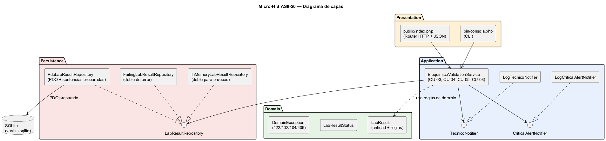
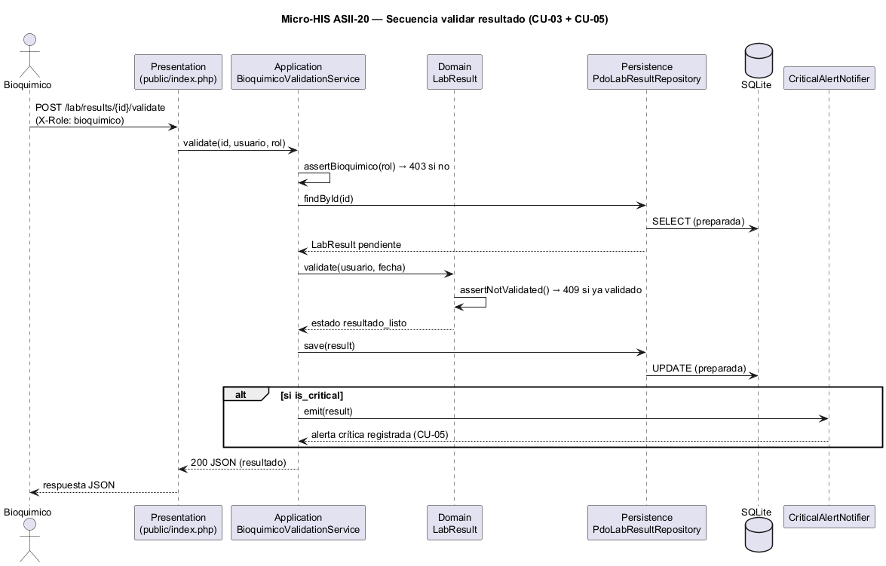

\newpage

<div style="text-align:center">

# **UNIVERSIDAD MARIANO GÁLVEZ DE GUATEMALA**

{width=40%}

**ANÁLISIS DE SISTEMAS II**

**Richard Ortiz**

</div>

\vspace{6em}

<div style="text-align:center">

# Micro-HIS Validación de resultados por bioquímico

## Micro servicios y monolito — Inicio del micro-monolito en capas (PHP 8.2+ vanilla)

</div>

\vspace{4em}

<div style="text-align:center">

**GERSON GIOVANNI ORELLANA VÉLIZ**

**Carnet: 1890-23-7082**

**Miércoles 19 de agosto de 2026**

</div>

\newpage

# Índice

1. Introducción
2. Ficha técnica y consigna
3. Arquitectura de capas
4. Reglas de dominio
5. Persistencia con PDO preparado
6. Presentación (HTTP y CLI)
7. Pruebas automatizadas
8. Ejecución y evidencia
9. Conclusión
10. Bibliografía

\newpage

# 1. Introducción

Esta actividad inicia un micro-monolito educativo y ejecutable para el módulo **Validación de resultados por bioquímico (ASII-20)**. El objetivo fue construir, en **PHP 8.2+ vanilla** y sin ningún framework, un programa que ejecute el flujo «revisión, validación o rechazo de un resultado por bioquímico», separando las responsabilidades en **Presentation, Application, Domain y Persistence**.

La separación por capas protege el dominio de los detalles de entrada (HTTP o consola) y de persistencia (base de datos), tal como se venía modelando desde la Tarea 2 con el principio de inversión de dependencias. Todos los datos usados son ficticios y no contienen información clínica identificable.

\newpage

# 2. Ficha técnica y consigna

| Campo | Descripción |
|---|---|
| **Universidad / Curso** | Análisis de Sistemas II — 2026 |
| **Estudiante** | GERSON GIOVANNI ORELLANA VÉLIZ |
| **Carnet** | 1890-23-7082 |
| **GitHub** | `gioore` |
| **Módulo oficial** | Validación de resultados por bioquímico |
| **Consigna individual** | Inicie «Micro-HIS Validación de resultados por bioquímico» en PHP 8.2+ vanilla para ejecutar «revisión, validación o rechazo de un resultado por bioquímico». |
| **Repositorio evaluado** | https://github.com/gioore/asii20-microhis-validacion-bioquimico-tareas |
| **Rama evaluada** | `main` |
| **Etiqueta evaluada** | `tarea-3-entrega` |
| **Requisitos técnicos** | PHP 8.2+ vanilla; capas Presentation, Application, Domain y Persistence; PDO preparado; configuración fuera del código; pruebas automatizadas; ningún framework. |

**Declaración de datos.** Todos los datos, nombres de pacientes, valores y resultados son **ficticios**. No se incluye información clínica identificable real.

\newpage

# 3. Arquitectura de capas



Fuente editable: `docs/capas.puml`

El micro-HIS separa cuatro capas:

- **Presentation**: `public/index.php` (HTTP JSON con router manual) y `bin/consola.php` (CLI). Solo traducen peticiones en llamadas al servicio.
- **Application**: `BioquimicoValidationService` orquesta los casos de uso (CU-03 validar, CU-04 rechazar, CU-05 crítico, CU-08 revalidar). Depende de abstracciones (DIP de la Tarea 2).
- **Domain**: la entidad `LabResult` y sus reglas (motivo obligatorio, crítico no rechazable, validación inmutable, rol).
- **Persistence**: la interfaz `LabResultRepository` con implementaciones `PdoLabResultRepository` (SQLite real) y los dobles `InMemory` y `Failing` para pruebas.

La configuración (`config/config.php`) vive **fuera del código**: la DSN, el tenant por defecto y los roles permitidos no están incrustados en `src/`.

# 4. Reglas de dominio

La entidad `LabResult` encapsula las reglas de negocio del módulo:

| Regla | Caso de uso | Código HTTP |
|---|---|---|
| El motivo del rechazo es obligatorio | CU-04 | 422 |
| Un valor crítico no puede rechazarse directamente | CU-05 | 422 |
| La validación es inmutable (no revalidar lo ya validado) | RNF-03 | 409 |
| Solo el rol Bioquímico puede validar o rechazar | RF-08 | 403 |
| Resultado inexistente | — | 404 |

Cada regla se lanza como una `DomainException` con su código HTTP, y la capa Presentation la traduce a la respuesta correspondiente.

\newpage

# 5. Persistencia con PDO preparado

La implementación real es `PdoLabResultRepository` sobre SQLite con **sentencias preparadas** (sin concatenar SQL). Ejemplo:

```php
$stmt = $this->pdo->prepare(
    'UPDATE lab_results
        SET status = :status, validated_by = :validated_by,
            validated_at = :validated_at, rejected_reason = :rejected_reason
      WHERE id = :id'
);
$stmt->execute([...]);
```

La DSN sale de `config/config.php`, fuera del código. El esquema y los datos ficticios están en `database/schema.sql` y `database/seed.php`. Los dobles `InMemoryLabResultRepository` y `FailingLabResultRepository` permiten probar el servicio sin infraestructura y simular errores de persistencia.

# 6. Presentación (HTTP y CLI)

**HTTP** (servidor integrado de PHP):

```
php -S localhost:8080 public/index.php
```

| Ruta | Método | Resultado |
|---|---|---|
| `/health` | GET | estado del módulo |
| `/lab/results/pending` | GET | resultados pendientes (CU-01) |
| `/lab/results/{id}/validate` | POST | validar (CU-03) |
| `/lab/results/{id}/reject` | POST | rechazar con motivo (CU-04) |
| `/lab/results/{id}/revalidate` | POST | revalidar corregido (CU-08) |
| `/lab/results/history` | GET | historial (RF-06) |

El sujeto se simula con las cabeceras `X-Tenant-Id`, `X-User` y `X-Role` (solo demo; el HIS real usa JWT).

**CLI**:

```
php bin/consola.php pendientes
php bin/consola.php validar 2
php bin/consola.php rechazar 3 "Muestra hemolizada"
php bin/consola.php historial
```

\newpage

# 7. Pruebas automatizadas



El runner es propio (`tests/run.php`), sin framework y sin dependencias:

```
php tests/run.php
```

| Prueba | Tipo |
|---|---|
| Validar resultado pendiente → `resultado_listo` | camino feliz |
| Confirmar valor crítico → alerta emitida | camino feliz |
| Rechazo sin motivo → 422 | regla de dominio |
| Valor crítico no rechazable → 422 | regla de dominio |
| Rechazo válido → técnico notificado | regla de dominio |
| Revalidar ya validado → 409 | regla de dominio |
| Rol sin permiso → 403 | regla de dominio |
| Guardar con doble que falla → error propagado | error de persistencia |

Resultado obtenido: **8 pasaron, 0 fallaron** (ver evidencia en la sección siguiente).

# 8. Ejecución y evidencia

Salida real de las pruebas automatizadas:

```
  [OK] Camino feliz: validar resultado pendiente -> resultado_listo
  [OK] Camino feliz: confirmar valor crítico genera alerta (CU-05)
  [OK] Regla de dominio: rechazo sin motivo es inválido (422)
  [OK] Regla de dominio: valor crítico no es rechazable directamente (CU-05)
  [OK] Regla de dominio: rechazo válido notifica al técnico (CU-04)
  [OK] Regla de dominio: validar algo ya validado es conflicto (409)
  [OK] Regla de dominio: rol sin permiso recibe 403 (RF-08)
  [OK] Error de persistencia: guardar falla y el error se propaga

Resultado: 8 pasaron, 0 fallaron
```

Salida real del CLI (flujo completo):

```
php bin/consola.php pendientes
  #1 | Paciente Ficticio A | Glucosa en ayunas = 126 mg/dL | pendiente
  #2 | Paciente Ficticio B | Potasio sérico = 6.1 mmol/L | pendiente [CRITICO]
  #3 | Paciente Ficticio C | Hemoglobina = 11.2 g/dL | pendiente

php bin/consola.php validar 1
Validado #1 (Glucosa en ayunas) por bioquimico-demo -> resultado_listo

php bin/consola.php rechazar 3 ""     → ERROR 422: El motivo del rechazo es obligatorio.
php bin/consola.php rechazar 3 "Valor no coincide con la muestra"
Rechazado #3 (Hemoglobina), motivo: Valor no coincide con la muestra. Tecnico notificado.
```

La evidencia Git (historial, enlace al commit y árbol de archivos) está en `EVIDENCIA_GIT.md`. La declaración de uso de IA está en `DECLARACION_IA.md`.

\newpage

# 9. Conclusión

**Qué se logró.** Se inició un micro-monolito educativo ejecutable en PHP vanilla: el módulo ASII-20 ya revisa, valida o rechaza un resultado por bioquímico con las cuatro capas pedidas, PDO con sentencias preparadas, configuración fuera del código y 8 pruebas automatizadas que pasan (camino feliz, reglas de dominio y error de persistencia).

**Decisión más relevante.** Mantener el dominio libre de framework y de detalles de entrada/persistencia. La entidad `LabResult` contiene las reglas (motivo obligatorio, crítico no rechazable, validación inmutable) y el servicio de aplicación depende de interfaces, retomando el DIP de la Tarea 2. Esto hizo que las pruebas fueran directas: se inyectaron dobles en memoria y un doble que falla sin tocar el código de producción.

**Limitación que permanece.** Es un punto de partida del micro-monolito: no hay autenticación JWT real (el rol se simula por cabecera), no hay interfaz de usuario y la validación de tenant está acotada al valor de configuración. Estas piezas corresponden a la evolución del micro-HIS y a la integración con el resto del sistema.

**Cómo la evidencia demuestra el cumplimiento.** El repositorio contiene las fuentes editables (`src/`, `.puml`, `.md`), el historial de commits con propósito y la etiqueta `tarea-3-entrega`, la salida real de las pruebas y del CLI, y las declaraciones de IA y defensa oral. Todo es reproducible con `php database/seed.php`, `php tests/run.php` y `php bin/consola.php`.

# 10. Bibliografía

- Object Management Group. *Unified Modeling Language (UML), versión 2.5.1*.
- Documentación oficial de PHP. «Supported Versions» y manual de PDO. https://www.php.net/docs.php