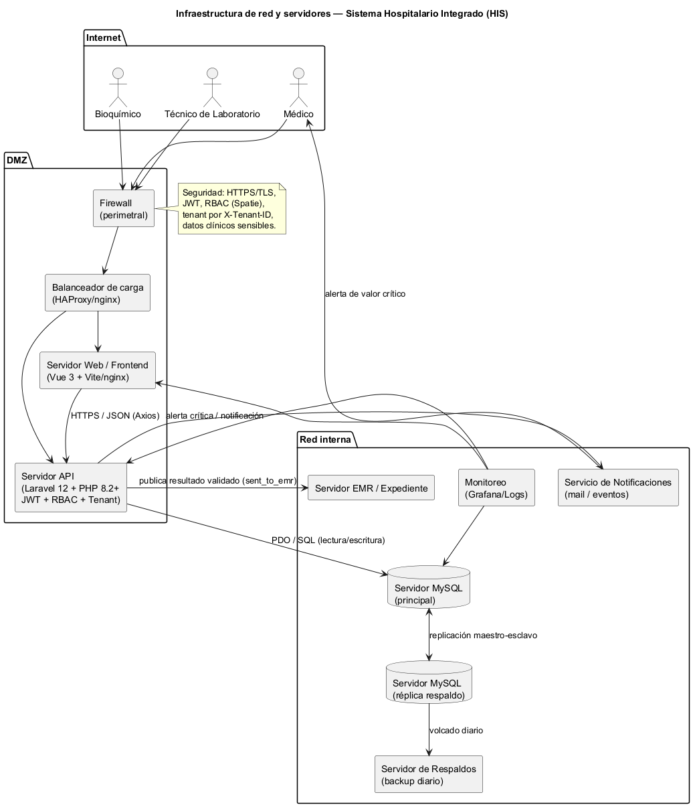

\newpage

# **UNIVERSIDAD MARIANO GÁLVEZ DE GUATEMALA**

{width=40%}

**ANÁLISIS DE SISTEMAS II**

**Richard Ortiz**

\vspace{6em}

# Infraestructura de red y servidores

## del Sistema Hospitalario Integrado

\vspace{4em}

**GERSON GIOVANNI ORELLANA VÉLIZ**

**Carnet: 1890-23-7082**

**Martes 18 de agosto de 2026**

\newpage

# Índice

1. Introducción
2. La vista general de la red
3. Seguridad y datos
4. Disponibilidad y respaldos
5. Conclusión
6. Bibliografía

\newpage

# 1. Introducción

Esta entrega fue sobre la infraestructura donde va a correr el sistema hospitalario. Como la aplicación es web y maneja datos clínicos, la parte de red y servidores no puede ser cualquier cosa: hace falta separar lo que está expuesto al público de lo que no, y cuidar que la base de datos no quede al alcance de cualquiera.

El sistema es de tres capas. El frontend está hecho en Vue 3, el backend es una API en Laravel 12 con PHP 8.2 y la base de datos es MySQL. A eso se suman el expediente electrónico, el servicio de notificaciones, el respaldo y el monitoreo. El diagrama que hice muestra esos servidores y cómo se comunican entre sí.

\newpage

# 2. La vista general de la red

El acceso empieza desde afuera. El bioquímico, el técnico de laboratorio y el médico entran por el navegador, y todo ese tráfico pasa primero por el firewall perimetral, donde solo se acepta el puerto 443, es decir HTTPS.

Después del firewall está la zona DMZ. Ahí van los servidores que sí necesitan ser alcanzados desde afuera: el balanceador de carga, el servidor web y la API. El balanceador reparte las peticiones, el servidor web sirve la aplicación de Vue y hace de intermediario con la API. La API de Laravel es la que expone los servicios, con JWT para autenticación y validando roles y tenant.

En la red interna están las cosas que no deben verse desde internet. La base de datos de MySQL es la principal, y junto a ella hay una réplica que sirve como respaldo en vivo y para repartir las lecturas. También están el servidor del expediente, el de notificaciones, el de respaldos y el de monitoreo. La API solo se comunica con la base de datos dentro de esta zona.

\newpage

# 3. Seguridad y datos

Lo que más me interesaba cuidar era el acceso a los datos clínicos. Todo lo que entra por internet va cifrado con TLS. La API usa JWT para la autenticación y los permisos se manejan con RBAC, de modo que solo el bioquímico puede validar resultados. Además el sistema es multitenant y cada petición lleva su tenant, para que un hospital no vea datos de otro.

La separación entre la DMZ y la red interna es lo que hace que la base de datos y el expediente no se puedan tocar desde afuera. Solo el firewall y la API se comunican con ellos. Eso, junto con el cifrado en tránsito, es lo mínimo que se necesita cuando se manejan datos de pacientes.

# 4. Disponibilidad y respaldos

Para que el sistema no se caiga, la base de datos principal tiene una réplica. Si el servidor principal falla, se puede seguir leyendo desde la réplica. Además hay un respaldo diario automatizado, y el monitoreo vigila la API, el servidor web y la base de datos para detectar rápido si algo deja de responder.

\newpage

# 5. Conclusión

El diagrama quedó con dos zonas bien definidas. La DMZ tiene lo que necesita estar afuera, y la red interna tiene la base de datos y los servicios internos. Esa separación es lo que protege los datos clínicos, y el TLS, el JWT, el RBAC y el tenant cubren la parte de seguridad del acceso.

En cuanto a disponibilidad, la réplica y los respaldos diarios dan tranquilidad si algo falla, y el monitoreo ayuda a detectarlo antes de que se convierta en un problema. En general la infraestructura cubre lo que el módulo necesita para correr de forma segura y estable.

# 6. Bibliografía

- Sistema Hospitalario Integrado, README con el stack del proyecto y plan semanal.
- Documentación de PHP y Laravel. https://www.php.net/docs.php
