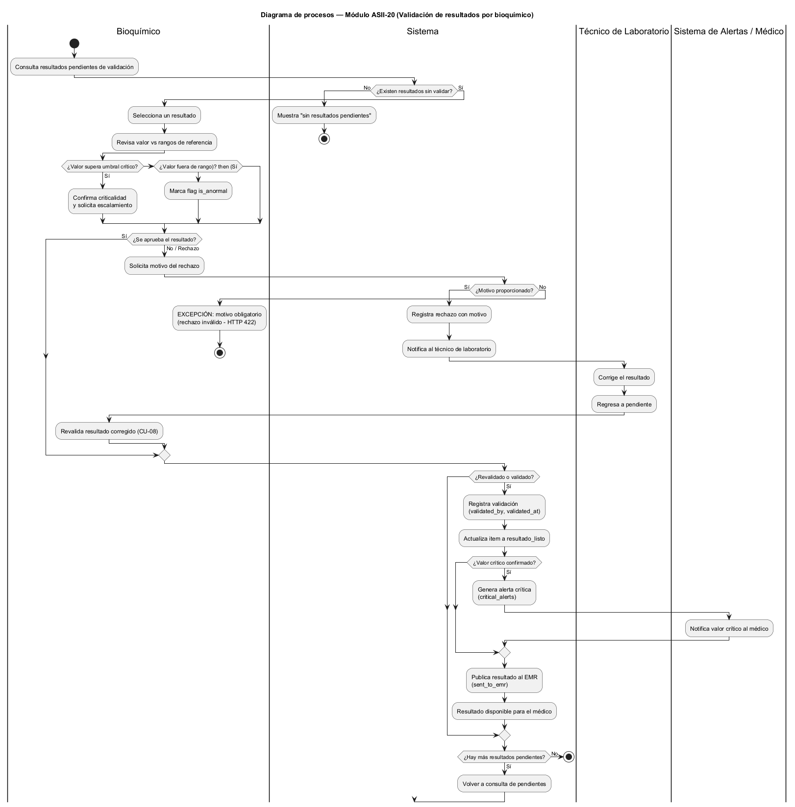
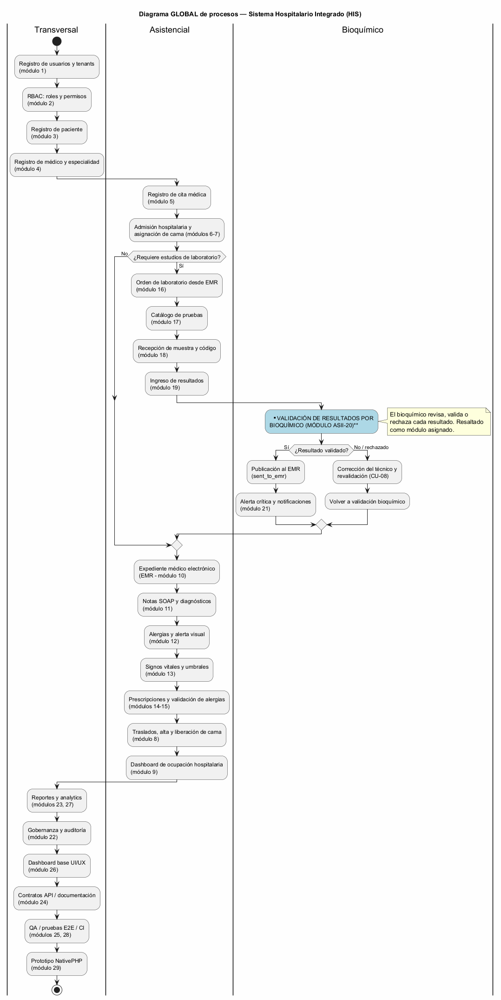

\newpage

# **UNIVERSIDAD MARIANO GÁLVEZ DE GUATEMALA**

{width=40%}

**ANÁLISIS DE SISTEMAS II**

**Richard Ortiz**

\vspace{6em}

# Diagrama de procesos del módulo ASII-20

## y vista global del Sistema Hospitalario Integrado

\vspace{4em}

**GERSON GIOVANNI ORELLANA VÉLIZ**

**Carnet: 1890-23-7082**

**Martes 18 de agosto de 2026**

\newpage

# Índice

1. Introducción
2. El proceso de validación del bioquímico
3. El diagrama global del HIS
4. Conclusión
5. Bibliografía

\newpage

# 1. Introducción

Para esta entrega tuve que dibujar dos diagramas. El primero es el proceso del módulo que me tocó, la validación de resultados por bioquímico. El segundo es una vista global de todo el sistema hospitalario, donde ese módulo queda ubicado dentro del flujo completo.

La idea detrás del módulo es simple: un resultado de laboratorio no debería llegar al médico sin que alguien lo revise primero, y ese alguien es el bioquímico. Cuando el técnico ingresa los resultados quedan pendientes de validación y ahí entra el módulo. Se compara el valor con los rangos de referencia, se decide si se valida o se rechaza, y si hay rechazo el resultado vuelve al técnico para corregirlo y luego se vuelve a revisar.

Para el diagrama global lo que hice fue ordenar los módulos del proyecto según el recorrido natural del paciente, desde el registro hasta los reportes. El módulo ASII-20 quedó resaltado en azul porque es el punto del laboratorio donde se revisa el resultado antes de publicarlo al expediente.

\newpage

# 2. El proceso de validación del bioquímico

Hice el diagrama con carriles porque participan tres personas además del sistema. El bioquímico consulta los resultados pendientes y escoge uno. Lo primero es comparar el valor contra los rangos de referencia: si supera el umbral crítico se confirma la criticalidad y se escala; si solo está fuera de rango, se marca como anormal y sigue el proceso normal.

Después viene la decisión de aprobar o rechazar. Si se aprueba, se guarda la validación con el usuario que la hizo y la fecha. Si se rechaza, el motivo es obligatorio; el sistema no acepta un rechazo sin explicación, eso lo puse como excepción en el diagrama. Cuando el técnico corrige el resultado, el bioquímico lo vuelve a revisar.

El caso del valor crítico lo tuve que pensar aparte. Cuando se confirma, además de seguir su camino normal se genera una alerta para que el médico se entere. Al final el resultado validado se publica al expediente electrónico y ahí el médico ya puede verlo.

\newpage

# 3. El diagrama global del HIS

En el diagrama global junté los módulos del proyecto y los puse en el orden en que se usan. Se empieza con el registro de usuarios, tenants y roles, luego el de pacientes y médicos. Después viene la cita, la admisión y la asignación de cama. Cuando el médico ordena estudios entra la parte del laboratorio: la orden, el catálogo de pruebas, la recepción de la muestra y el ingreso de resultados.

Ahí es donde entra mi módulo. En el diagrama quedó resaltado en azul porque es el punto donde el resultado se revisa antes de publicarse. Si se valida, se publica al expediente y se generan las alertas críticas cuando hace falta. Si se rechaza, el resultado vuelve para corrección y después se revalida, así que el flujo regresa al mismo punto.

Después del laboratorio el proceso sigue con la atención clínica: expediente, notas SOAP, alergias, signos vitales, prescripciones, alta y reportes. También hay módulos que no siguen el recorrido del paciente, como los de usuarios, auditoría o QA, y esos van acompañando a todo el sistema y no a una parte puntual.

\newpage

# 4. Conclusión

Al final quedaron los dos diagramas. El primero deja claro cómo funciona la validación en el módulo, con sus decisiones, sus excepciones y quién participa en cada paso. El segundo muestra que el módulo no es un sistema aparte sino una pieza del laboratorio que conecta con el ingreso de resultados por un lado y con el expediente y las alertas por el otro.

El punto más importante del módulo es que funciona como un filtro de calidad. Sin esa revisión, un valor mal ingresado podría llegar directo al expediente del paciente. Por eso la validación, el motivo obligatorio en el rechazo y la alerta crítica están conectados en el mismo proceso.

# 5. Bibliografía

- Sistema Hospitalario Integrado, README y asignación de módulos, Análisis de Sistemas II 2026.
- Object Management Group, Unified Modeling Language (UML), versión 2.5.1.
