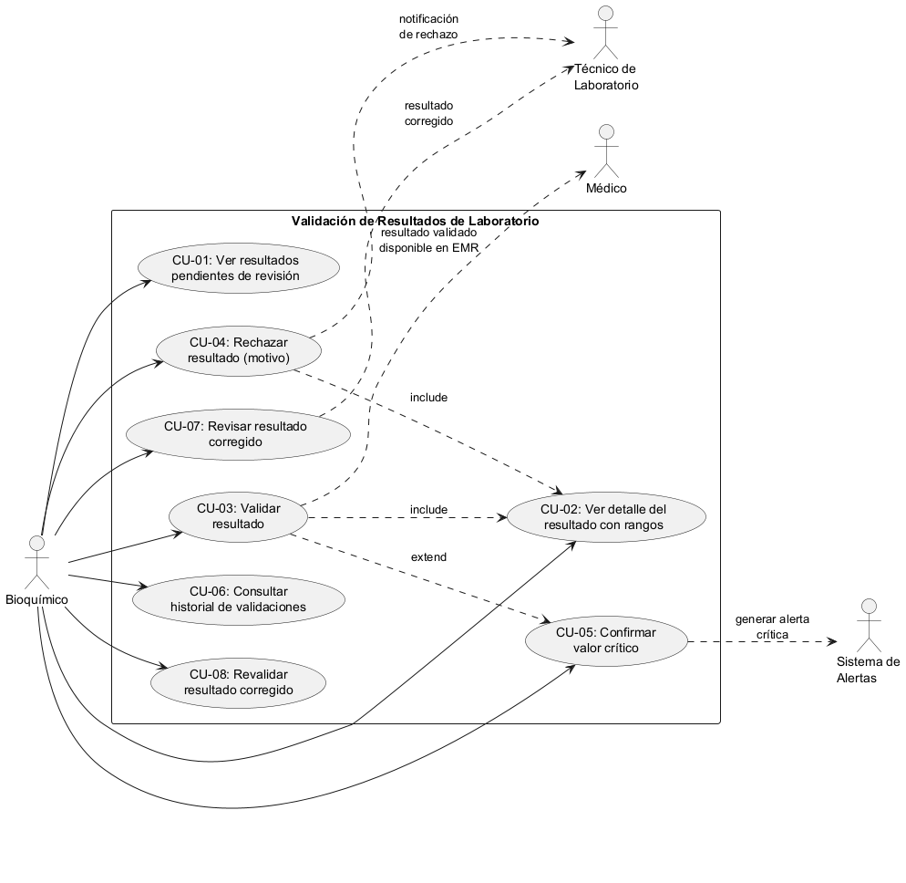
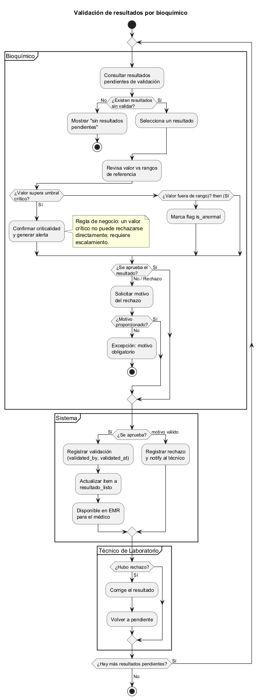
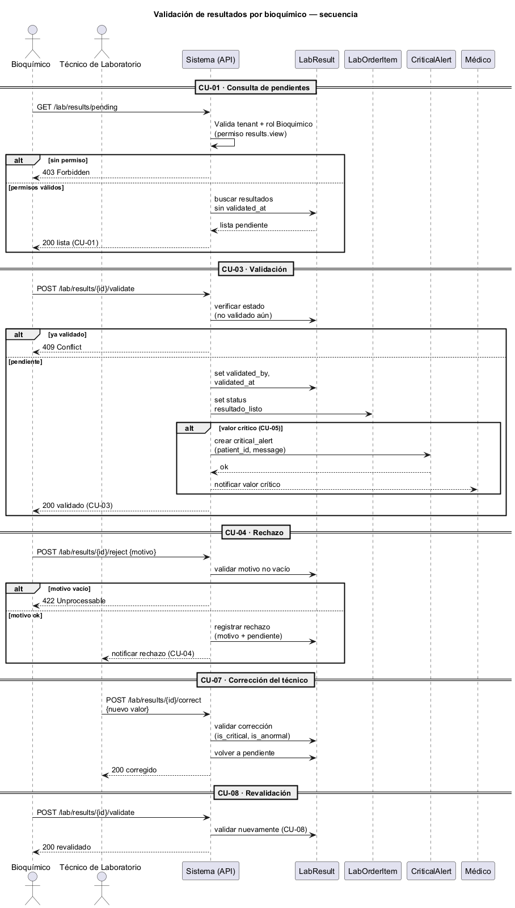

# Análisis de Sistemas II — 2026

## Tarea 1: Diagramas UML por módulo

### Portada

| Campo | Descripción |
|---|---|
| **Universidad / Curso** | Análisis de Sistemas II — 2026 |
| **Estudiante** | GERSON GIOVANNI ORELLANA VÉLIZ |
| **GitHub** | `gioore` |
| **Módulo oficial** | Validación de resultados por bioquímico |
| **Consigna individual** | Modele el proceso «revisión, validación o rechazo de un resultado por bioquímico» |
| **Repositorio evaluado** | https://github.com/gioore/asii20-microhis-validacion-bioquimico-tareas |
| **Rama evaluada** | `main` |
| **Etiqueta evaluada** | `tarea-1-entrega` |
| **Documentos entregables** | `tarea1-uml.pdf` y `tarea1-uml.docx` |

**Declaración de datos.** Todos los datos, nombres de pacientes, valores y resultados empleados en este documento y en los diagramas son **ficticios**. No se incluye información clínica identificable real.

---

## Índice

1. Introducción
2. Desarrollo
   2.1. Diagrama de casos de uso
   2.2. Diagrama de actividad
   2.3. Diagrama de secuencia
   2.4. Matriz de trazabilidad requisito → diagrama → elemento
3. Conclusión
4. Bibliografía

---

## 1. Introducción

El módulo **Validación de resultados por bioquímico** del sistema hospitalario integrado controla el punto de control de calidad del laboratorio clínico: ningún resultado puede quedar disponible para el médico hasta ser revisado y **validado** por un bioquímico. La presente tarea modela ese proceso de negocio —«revisión, validación o rechazo de un resultado por bioquímico»— mediante tres perspectivas complementarias de UML: **casos de uso**, **actividad** y **secuencia**.

El proceso inicia cuando un técnico de laboratorio ingresa resultados pendientes y le asocia una prueba con su rango de referencia. El bioquímico consulta la lista de pendientes, revisa cada valor, y decide **validarlo** (quedando `resultado_listo`) o **rechazarlo** indicando un motivo. Un rechazo genera una notificación al técnico, que corrige el resultado y lo vuelve a dejar pendiente para su **revalidación**. Si el valor supera el umbral crítico, se genera una alerta crítica y se notifica al médico.

Los tres diagramas comparten los mismos actores —Bioquímico, Técnico de Laboratorio, Médico y Sistema de Alertas—, los mismos pasos, mensajes y excepciones, y mantienen trazabilidad entre sí mediante la matriz requisito → diagrama → elemento (sección 2.4). Los datos son ficticios.

---

## 2. Desarrollo

### 2.1 Diagrama de casos de uso

Fuente editable: `casos-de-uso.puml`

**Actores y objetivo.** El actor principal es el **Bioquímico**, responsable de la revisión. Como actores secundarios intervienen el **Técnico de Laboratorio**, el **Médico** y el **Sistema de Alertas**.

**Casos de uso (CU) identificados:**

| CU | Nombre | Relación |
|---|---|---|
| CU-01 | Ver resultados pendientes de revisión | consulta inicial |
| CU-02 | Ver detalle con rangos de referencia | `include` de CU-03 y CU-04 |
| CU-03 | Validar resultado | núcleo del proceso |
| CU-04 | Rechazar resultado (con motivo) | núcleo del proceso |
| CU-05 | Confirmar valor crítico | `extend` de CU-03 |
| CU-06 | Consultar historial de validaciones | — |
| CU-07 | Revisar resultado corregido | — |
| CU-08 | Revalidar resultado corregido | — |

**Justificación de `include` y `extend`.** CU-03 y CU-04 **siempre** requieren ver el detalle con rangos para poder decidir, por lo que `CU-03 ..> CU-02 : include` y `CU-04 ..> CU-02 : include` (relación obligatoria, no opcional). En cambio, CU-05 **solo** actúa cuando el valor supera el umbral crítico (condicional), por lo que se modela con `extend`: `CU-05 ..> CU-03 : extend`. Esto refleja correctamente la semántica UML: `include` = siempre, `extend` = condicional.

**Objetivo del actor.** El Bioquímico persigue reducir al máximo el resultado no validado en el EMR: garantizar que todo resultado accesible al médico cumple el control de calidad, registrando responsable (`validated_by`) y fecha (`validated_at`).

---

### 2.2 Diagrama de actividad

Fuente editable: `actividad.puml`

**Modelo con swimlanes** que asignan cada paso al actor responsable:

- **Bioquímico**: consulta de pendientes, selección del resultado, revisión contra rangos, decisión validar/rechazar y confirmación de valor crítico.
- **Sistema**: registro de la validación, actualización de estado a `resultado_listo`, registro del rechazo y notificación.
- **Técnico de Laboratorio**: corrección del resultado y retorno a pendiente.

**Decisiones (decisión nodos):**
- ¿Existen resultados sin validar? → No: mensaje «sin resultados pendientes» y fin.
- ¿El valor supera el umbral crítico? → Sí: confirmación de criticalidad y generación de alerta.
- ¿Está fuera del rango (anormal)? → Sí: marca `is_anormal`.
- ¿Se aprueba el resultado? → Sí: validación. No: solicitud de motivo de rechazo.
- ¿Motivo proporcionado? → No: **excepción** motivo obligatorio.

**Excepciones (reglas de negocio):**
- **Motivo de rechazo obligatorio**: sin motivo, el rechazo es inválido (`422`).
- **Valor crítico no se rechaza directamente**: un valor crítico debe escalarse mediante alerta; no puede ser descartado sin elevar.

**Ciclo de corrección.** El diagrama cierra el flujo: rechazo → corrección del técnico → retorno a pendiente → revalidación (CU-07/CU-08), mediante el bucle `repeat while (¿hay más resultados pendientes?)`.

---

### 2.3 Diagrama de secuencia

Fuente editable: `secuencia.puml`

**Participantes:** Bioquímico, Técnico de Laboratorio, API del sistema, entidades LabResult, LabOrderItem y CriticalAlert, y el Médico.

**Mensajes HTTP y validaciones:**

| **CU** | Mensaje | Comportamiento |
|---|---|---|
| CU-01/CU-02 | `GET` resultados pendientes | autenticación y permisos de la API; `403` sin rol |
| CU-03 | `POST …/validate` | guarda `validated_by`, `validated_at`; `409` si ya validado |
| CU-05 | crear `CriticalAlert` | validación del umbral crítico; notificación al médico |
| CU-04 | `POST …/reject {motivo}` | `422` si motivo vacío (excepción) |
| CU-07 | `POST …/correct {nuevo valor}` | validación de la corrección; retorno a pendiente |
| CU-08 | `POST …/validate` | revalidación del resultado corregido |

**Excepciones de la API:** `403` (permiso insuficiente), `409` (resultado ya validado) y `422` (motivo de rechazo faltante). El diagrama muestra participantes, mensajes, validaciones y su respuesta, que es el requisito del enunciado.

---

### 2.4 Matriz de trazabilidad requisito → diagrama → elemento

La matriz completa está en `matriz-trazabilidad.md`. Cada `CU` se correlaciona con su nodo del diagrama de actividad y con su mensaje del diagrama de secuencia:

| Requisito / CU | Diagrama de casos de uso | Diagrama de actividad | Diagrama de secuencia |
|---|---|---|---|
| CU-03 Validar | CU-03 | «Registrar validación (validated_by, validated_at)»; item `resultado_listo` | `POST …/validate` |
| CU-04 Rechazar con motivo | CU-04 `include` CU-02 | decisión «¿Motivo proporcionado?»; excepción motivo obligatorio | `POST …/reject`; `422` |
| CU-05 Valor crítico | CU-05 `extend` CU-03 | decisión umbral crítico; nota de escalamiento | `CriticalAlert`; notifica al médico |
| CU-07/CU-08 Corrección | CU-07/CU-08 | partición Técnico; bucle `repeat while` | `POST …/correct`; `POST …/validate` |

De este modo, los tres diagramas quedan **trazables, coherentes y reproducibles** desde sus fuentes `.puml`.

---

## 3. Conclusión

Se logró un modelado completo y trazable del proceso de validación de resultados por bioquímico. El diagrama de casos de uso delimita actores y objetivos (CU-01 a CU-08); el de actividad expresa decisiones, excepciones y reglas de negocio con swimlanes; y el de secuencia describe participantes, mensajes HTTP y validaciones con sus respuestas. Los tres comparten el mismo modelo de actores y estados, por lo que se cumplen los requisitos del enunciado.

La decisión **más relevante** fue la regla de negocio de que un **valor crítico no puede rechazarse directamente** y debe escalarse: conduce el `extend` de CU-05 sobre CU-03, define la divergencia correspondiente en el diagrama de actividad y se refleja en la secuencia mediante la creación de `CriticalAlert` y la notificación al médico. Es la decisión que más influyó en la coherencia entre los tres artefactos.

La principal **limitación** es que el modelo conceptual no cubre concurrencia ni auditoría de movimientos —fuera del alcance de la semana y pertenecientes a otros módulos del sistema.

La **evidencia del cumplimiento** reposa en: las fuentes editables (`.puml`) que reproducen cada diagrama, la matriz de trazabilidad, el historial Git (commits con propósito, `git log --oneline`) y el repositorio compartido con el docente, etiquetado como `tarea-1-entrega`. La defensa oral permitirá justificar estas decisiones.

---

## 4. Bibliografía

- Object Management Group. *Unified Modeling Language (UML), versión 2.5.1*. Specification formal/2017-12-05.
- Documentación oficial de PHP. «Supported Versions» y manual de PDO. https://www.php.net/docs.php (cuando corresponda).