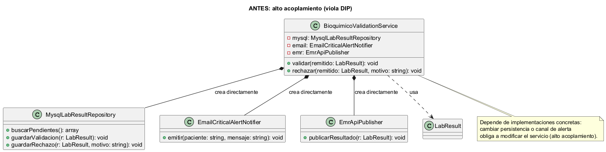
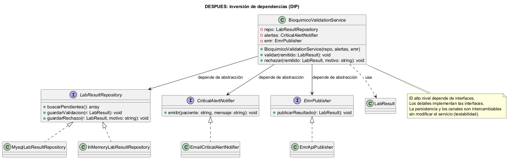

\newpage

<div style="text-align:center">

# **UNIVERSIDAD MARIANO GÁLVEZ DE GUATEMALA**

{width=40%}

**ANÁLISIS DE SISTEMAS II**

**Richard Ortiz**

</div>

\vspace{6em}

<div style="text-align:center">

# Aplicación de DIP (Inversión de Dependencias)

## Flujo «revisión, validación o rechazo de un resultado por bioquímico»

</div>

\vspace{4em}

<div style="text-align:center">

**GERSON GIOVANNI ORELLANA VÉLIZ**

**Carnet: 1890-23-7082**

**Viernes 14 de agosto de 2026**

</div>

\newpage

# Índice

1. Introducción
2. Desarrollo
   - 2.1. Ficha técnica
   - 2.2. Requerimientos funcionales y no funcionales
   - 2.3. Principio aplicado: DIP (fuente obligatoria)
   - 2.4. Diseño antes (anti-patrón)
   - 2.5. Diseño después (aplicación de DIP)
   - 2.6. Justificación de responsabilidades y dependencias
   - 2.7. Código PHP antes/después
   - 2.8. Criterios de aceptación y trazabilidad
3. Conclusión
4. Bibliografía

\newpage

# 1. Introducción

Esta tarea convierte los requisitos del módulo **Validación de resultados por bioquímico** en una **mejora de diseño verificable** aplicando el principio **DIP (Dependency Inversion Principle)** de la fuente obligatoria. El flujo modelado es el mismo de la Tarea 1: el bioquímico **revisa, valida o rechaza** un resultado de laboratorio, notificando al técnico cuando hay rechazo y generando una alerta crítica cuando el valor es crítico.

El objetivo es demostrar que la arquitectura del módulo no depende de implementaciones concretas de persistencia ni de canales de notificación: las clases de alto nivel dependen de **abstracciones**, y las de bajo nivel implementan esas abstracciones. Esto reduce el acoplamiento, facilita las pruebas (sustitución por dobles) y permite cambiar la base de datos o el canal de alerta sin modificar la lógica de validación.

Para ello se presentan: los requerimientos funcionales y no funcionales, el principio DIP con la **cita exacta** del artículo, el diseño **antes** (violación) y **después** (aplicación), el código PHP correspondiente y los criterios de aceptación verificables. Todos los datos son ficticios y no contienen información clínica identificable.

\newpage

# 2. Desarrollo

## 2.1 Ficha técnica

| Campo | Descripción |
|---|---|
| **Universidad / Curso** | Análisis de Sistemas II — 2026 |
| **Estudiante** | GERSON GIOVANNI ORELLANA VÉLIZ |
| **Carnet** | 1890-23-7082 |
| **GitHub** | `gioore` |
| **Módulo oficial** | Validación de resultados por bioquímico |
| **Consigna individual** | Aplique DIP al diseño del flujo «revisión, validación o rechazo de un resultado por bioquímico» |
| **Repositorio evaluado** | https://github.com/gioore/asii20-microhis-validacion-bioquimico-tareas |
| **Rama evaluada** | `main` |
| **Etiqueta evaluada** | `tarea-2-entrega` |
| **Documentos entregables** | `tarea2-solid.pdf` y `tarea2-solid.docx` |

**Declaración de datos.** Todos los datos, nombres de pacientes, valores y resultados empleados son **ficticios**. No se incluye información clínica identificable real.

## 2.2 Requerimientos funcionales y no funcionales

Ver el detalle completo en `rf-rnf-dip.md`. Resumen de los RF vinculados al diseño DIP:

| ID | Requerimiento | Abstracción en el diseño |
|---|---|---|
| RF-01 | Ver panel de resultados pendientes | `LabResultRepository::buscarPendientes()` |
| RF-03 | Validar resultado (guardar `validated_by`, `validated_at`, `resultado_listo`) | `LabResultRepository::guardarValidacion()` |
| RF-04 | Rechazar con motivo obligatorio y notificar al técnico | `LabResultRepository::guardarRechazo()` + `TecnicoNotifier` |
| RF-05 | Confirmar valor crítico y generar alerta | `CriticalAlertNotifier::emitir()` |
| RF-08 | Restringir acciones al rol Bioquímico | validación de rol en el servicio |

Los RNF relevantes son: **RNF-04 Mantenibilidad** (el alto nivel no depende de detalles), **RNF-05 Testabilidad** (repositorios y notificadores intercambiables por dobles) y **RNF-06 Auditabilidad**.

## 2.3 Principio aplicado: DIP (fuente obligatoria)

**Fuente:** [Principios básicos del diseño de software – MVP Cluster](https://mvpcluster.com/diseno-de-software-2/)

**Cita exacta del artículo (sección Dependency Inversion):**

> «Este principio busca que no existan un alto acoplamiento en las aplicaciones, ya que ello repercute en un difícil mantenimiento. El principio quiere decir que las clases de alto nivel no tienen que depender de otras de bajo nivel, sino que ambas dependan de abstracciones, así como que las abstracciones no deben depender de los detalles, sino al contrario.» — MVP Cluster, *Principios básicos del diseño de software*.

**Aplicación al módulo:** el servicio `BioquimicoValidationService` es la clase de **alto nivel** (define la política de validación). Los repositorios y notificadores son clases de **bajo nivel** (detalles de persistencia y comunicación). En lugar de que el servicio cree e instancie esas clases concretas, ambas dependen de interfaces: `LabResultRepository`, `CriticalAlertNotifier` y `EmrPublisher`.

## 2.4 Diseño antes (anti-patrón)

{width=95%}

Fuente editable: `antes.puml`

En el diseño inicial, `BioquimicoValidationService` **instancia directamente** `MysqlLabResultRepository`, `EmailCriticalAlertNotifier` y `EmrApiPublisher`. Consecuencias:

- **Alto acoplamiento**: la lógica de validación depende de clases concretas.
- **Cambio costoso**: cambiar la persistencia a otro motor, o el canal de alerta, obliga a modificar el servicio.
- **Difícil de probar**: no se puede sustituir el repositorio por un doble sin tocar el código de producción.

## 2.5 Diseño después (aplicación de DIP)

{width=95%}

Fuente editable: `despues.puml`

En el rediseño, el servicio de alto nivel **depende de interfaces** y recibe sus dependencias por **constructor injection**:

```php
class BioquimicoValidationService
{
    public function __construct(
        private LabResultRepository $repo,
        private CriticalAlertNotifier $alertas,
        private EmrPublisher $emr
    ) {}
}
```

- `MysqlLabResultRepository` y `InMemoryLabResultRepository` **implementan** `LabResultRepository`.
- `EmailCriticalAlertNotifier` implementa `CriticalAlertNotifier`.
- `EmrApiPublisher` implementa `EmrPublisher`.

Ambos niveles dependen de la abstracción; los detalles implementan la abstracción. El servicio ya no sabe qué motor usa la persistencia ni qué canal emite la alerta.

## 2.6 Justificación de responsabilidades y dependencias

| Clase | Responsabilidad | Dependencia |
|---|---|---|
| `BioquimicoValidationService` | Orquesta revisión, validación y rechazo | interfaces inyectadas |
| `LabResultRepository` (interfaz) | Define contrato de persistencia | ninguna (abstracción) |
| `MysqlLabResultRepository` | Persistencia MySQL | implementa `LabResultRepository` |
| `InMemoryLabResultRepository` | Persistencia en memoria (pruebas) | implementa `LabResultRepository` |
| `CriticalAlertNotifier` (interfaz) | Define contrato de alerta crítica | ninguna (abstracción) |
| `EmailCriticalAlertNotifier` | Envío de alerta por correo | implementa `CriticalAlertNotifier` |
| `EmrPublisher` (interfaz) | Publicación en el expediente (EMR) | ninguna (abstracción) |
| `EmrApiPublisher` | Publicación vía API del EMR | implementa `EmrPublisher` |

La dirección de las dependencias se **invierte**: antes el servicio apuntaba a los detalles; ahora los detalles apuntan a las interfaces. Esto es exactamente lo que establece la cita del artículo.

## 2.7 Código PHP antes/después

**Antes (viola DIP):**

```php
class BioquimicoValidationService
{
    public function validar(int $resultId): void
    {
        $repo = new MysqlLabResultRepository();      // bajo nivel concreto
        $alertas = new EmailCriticalAlertNotifier(); // bajo nivel concreto
        $emr = new EmrApiPublisher();                // bajo nivel concreto

        $resultado = $repo->obtenerPorId($resultId);
        if ($resultado->esCritico()) {
            $alertas->emitir($resultado->paciente(), 'Valor crítico');
        }
        $repo->guardarValidacion($resultado);
        $emr->publicarResultado($resultado);
    }
}
```

**Después (aplica DIP):**

```php
class BioquimicoValidationService
{
    public function __construct(
        private LabResultRepository $repo,
        private CriticalAlertNotifier $alertas,
        private EmrPublisher $emr
    ) {}

    public function validar(int $resultId): void
    {
        $resultado = $this->repo->obtenerPorId($resultId);
        if ($resultado->esCritico()) {
            $this->alertas->emitir($resultado->paciente(), 'Valor crítico');
        }
        $this->repo->guardarValidacion($resultado);
        $this->emr->publicarResultado($resultado);
    }
}
```

**Evidencia de validación:** el rediseño permite inyectar `InMemoryLabResultRepository` y un notificador falso en las pruebas (RNF-05), y cambiar `MysqlLabResultRepository` por `PostgresLabResultRepository` sin tocar el servicio (RNF-04).

## 2.8 Criterios de aceptación y trazabilidad

| ID | Criterio de aceptación | Estado |
|---|---|---|
| CA-RF-01 | El servicio no instancia repositorios ni notificadores concretos; todos se inyectan | ✅ diseño |
| CA-RF-03 | `validated_by` y `validated_at` quedan guardados; item `resultado_listo` | ✅ |
| CA-RF-04 | Rechazo sin motivo no se acepta; motivo registrado y técnico notificado | ✅ |
| CA-RF-05 | Al confirmar crítico se emite alerta por la abstracción | ✅ |
| CA-RF-08 | Sin rol Bioquímico se recibe 403 | ✅ |
| CA-RNF-04 | Cambiar persistencia no requiere modificar el servicio | ✅ diseño DIP |
| CA-RNF-05 | Las pruebas sustituyen el repositorio por un doble sin tocar el servicio | ✅ |

La trazabilidad con la Tarea 1 se mantiene: RF-03↔CU-03, RF-04↔CU-04, RF-05↔CU-05 y RF-07↔CU-08.

\newpage

# 3. Conclusión

Se logró convertir los requisitos del módulo en una mejora de diseño **verificable** aplicando DIP al flujo de revisión, validación o rechazo de un resultado por bioquímico. El servicio de alto nivel ya no depende de implementaciones concretas de persistencia ni de notificación: depende de interfaces inyectadas, y las clases de bajo nivel implementan esas interfaces, tal como exige la cita literal del artículo de MVP Cluster.

La decisión **más relevante** fue invertir la dirección de la dependencia de `BioquimicoValidationService`: en lugar de que el servicio cree sus repositorios y notificadores, estos se inyectan por constructor. Esa decisión habilita la **testabilidad** (RNF-05) y la **mantenibilidad** (RNF-04), que son los beneficios que la fuente atribuye al principio.

La principal **limitación** es que el cambio es a nivel de diseño y no incluye la implementación completa de las clases concretas ni pruebas automatizadas ejecutables, que corresponden a la fase de desarrollo (Tareas 3 y 4).

La **evidencia del cumplimiento** reposa en: las fuentes editables (`antes.puml`, `despues.puml`), el código PHP antes/después, la cita exacta del artículo, la matriz de criterios de aceptación, el historial Git con commits por propósito y el repositorio compartido con el docente etiquetado como `tarea-2-entrega`.

\newpage

# 4. Bibliografía

- MVP Cluster. *Principios básicos del diseño de software*. https://mvpcluster.com/diseno-de-software-2/ (consulta: 31 de julio de 2026).
- Object Management Group. *Unified Modeling Language (UML), versión 2.5.1*. Especificación formal/2017-12-05.
- Documentación oficial de PHP. «Supported Versions» y manual de PDO. https://www.php.net/docs.php (cuando corresponda).